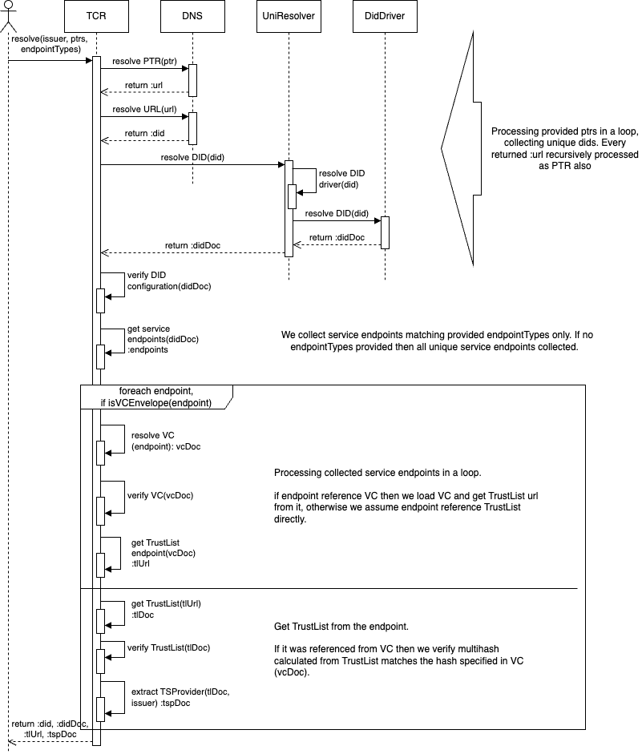

# The overarching TRAIN Architecture
The overarching TRAIN architecture documentation is located in the [Train Architecture Documentation](https://gitlab.eclipse.org/eclipse/xfsc/train/TRAIN-Documentation) repository.

# Diagrams:
Diagrams are designed using Draw.io and stored here as image exports for future modification.

# Current Status:

Trust Framework Pointer resolution process is explained on the following diagram:

