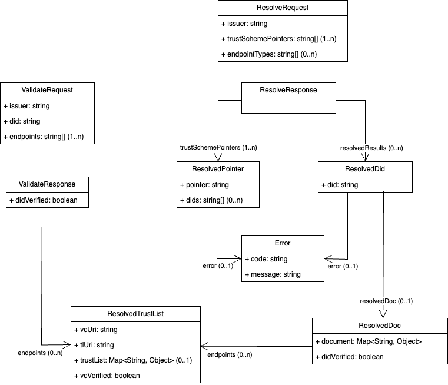

## TCR Client API

The TCR service provides client libraries which can be used to simplify access to the TCR backend and hides details of underlying HTTP/REST communication. Client libraries are provided for the following programming languages:

- [Java](./clients/java)
- [Go](./clients/go/tcr/docs)
- [JavaScript](./clients/js)
- [Python](./clients/py)

**Please follow the links to the respective language for instructions how to generate and use the client library!**

The structures used in requests/responses are specified in the TCR [OpenAPI contract](../../openapi/tcr_openapi.yaml) and on the diagram below:  

 

